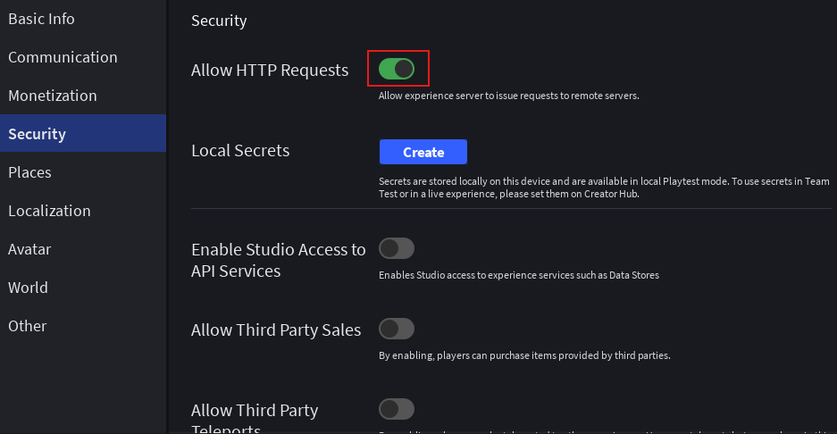
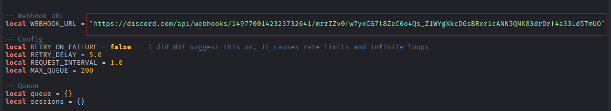
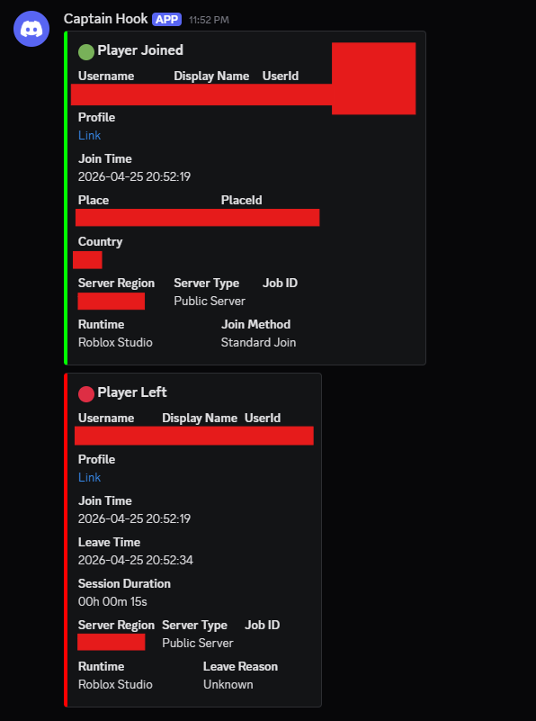

<!-- README.md -->

# RBLX Discord Webhook Logger

A simple and efficient Roblox script that logs player joins and leaves to a Discord webhook.

---

## Requirements

- Roblox Studio (i guess u have)
- A Discord webhook URL
- HTTP requests enabled in your Roblox game [learn how to enable HTTP requests](https://create.roblox.com/docs/tr-tr/cloud-services/http-service)
- A Roblox game

---

## Placement

```text
Game/
├── ...
├── ServerScriptService/
│   ├── Logging.luau <---
│   ├── Region.luau <---
│   ├── ...
└── ...
```

---

## Configuration

In [Logging.luau](src/Game/ServerScriptService/Logging.luau):

```lua
...
-- Webhook URL
local WEBHOOK_URL = "YOUR_DISCORD_WEBHOOK_URL" -- replace with your actual webhook URL

-- Config
local RETRY_ON_FAILURE = false -- set to true to retry failed requests, otherwise failed requests will be dropped (i not recommended this cause of ratelimits and infinite loops)
local RETRY_DELAY = 5.0 -- delay in seconds before retrying a failed request (only used if RETRY_ON_FAILURE is true)
local REQUEST_INTERVAL = 1.0 -- minimum interval in seconds between requests to avoid hitting rate limits
local MAX_QUEUE = 200 -- maximum number of messages to queue before dropping new messages
...
```

---

## Usage

Just copy `src/Game/ServerScriptService/` content to your game's `ServerScriptService` and replace the `WEBHOOK_URL` variable with your actual Discord webhook URL. The script will automatically log player joins and leaves to the specified webhook. You can see log embeds in your Discord channel whenever a player joins or leaves the game.

---

### 1. Create a webhook

Crate a webhook in your Discord channel and copy the webhook URL.


### 2. Enable HTTP requests in your Roblox game

Go to `File` > `Experience Settings` > `Security` and enable `Allow HTTP Requests`.


### 3. Configure the logging script

Replace the `YOUR_DISCORD_WEBHOOK_URL` variable in `Logging.luau` with your actual Discord webhook URL.
<br>

<br>

- Your Webhook URL is server-sided, player non-owners cant see it, so dont worry

### 4. Test the script

Play your game in Roblox Studio and check your Discord channel for log messages whenever a player joins or leaves the game.
<br>

<br>

- In Roblox Studio Test, Server Region is selecting by your devices' IP, Job ID will not appears

---

## Used Services

- [Thumbnail API](https://create.roblox.com/docs/tr-tr/cloud/reference/domains/thumbnails) for getting player avatars
- [Roproxy](https://devforum.roblox.com/t/roproxycom-a-free-rotating-proxy-for-roblox-apis/1508367) for bypassing Roblox API blocking
- [IPinfo](https://ipinfo.io/) for getting server region
- [Discord Webhooks](https://discord.com/developers/docs/resources/webhook) for sending log messages to Discord

---

## Troubleshooting

- Make sure you have enabled HTTP requests in your Roblox game settings.
- Check the output console in Roblox Studio for any error messages related to the logging script.
- Ensure that your Discord webhook URL is correct and properly formatted.
- If you are experiencing rate limits, consider adjusting the `REQUEST_INTERVAL` and `MAX_QUEUE` settings in the `Logging.luau` script.
- If you have enabled the retry mechanism, check the output console for any retry attempts and adjust the `RETRY_DELAY` as needed. Also check in Test Mode; Debug Console (F9) > Network > HTTP Requests for any failed requests and their responses. Important status codes:
  - 429 Too Many Requests: You are being rate limited. Consider increasing the `REQUEST_INTERVAL` or reducing the number of messages being sent.
  - 400 Bad Request: There is an issue with the payload being sent to the webhook. Check the output console for any error messages related to the payload formatting.
  - 500 Internal Server Error: There is an issue on Discord's end. This is usually temporary, so you may want to wait and try again later.
- Servers-and-Clients mode is not suppported, in this mode players take fake negative IDs and causes unexpected behaviors

---

## Develop Ideas

- Add more events to log (e.g., player deaths, chat messages, etc.)
- Implement a more robust retry mechanism for failed requests
- Add support for custom embed colors and formatting
- Another variants for other webhook platforms
- Add a configuration module for easier customization without modifying the main script (im lazy)

---

## License

Unlicensed. Do whatever you want with this code, but i not responsible for any damage or issues caused by using this code. Use at your own risk.

---

<!-- Repo Info -->


