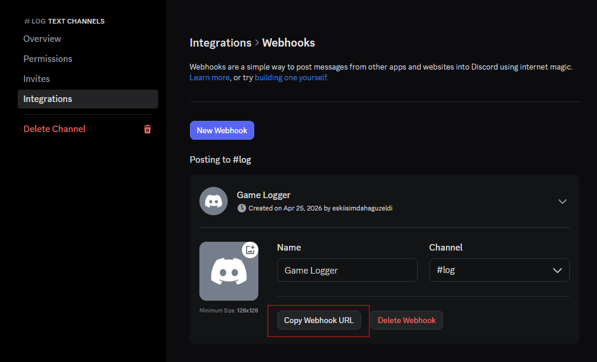
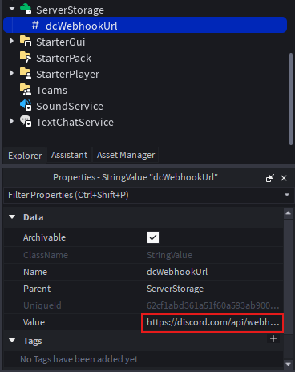

<!-- README.md -->

# RBLX Discord Webhook Logger


<br>


Basic script that logs events via Discord webhooks for your Roblox Games!

---

## Requirements

- Roblox Studio
- A Discord webhook URL
- HTTP requests enabled in your Roblox game [learn how to enable HTTP requests](https://create.roblox.com/docs/tr-tr/cloud-services/http-service)
- A Roblox game

---

## Features

### Logging

- Player Join/Leave
- Server Create
- Chatting
- Server Shutdown

### Utilities

- Installer script for model (.rbxm) file
- Basic webhook URL configuration
- Rojo compatible
- Portable small script

---

## Installation

### 1. Create model/game file with Rojo

- Game

```bash
rojo build default.project.json -o RBLX-DiscordWebhookLogger.rbxl
```

- Model

```bash
rojo build model.project.json -o RBLX-DiscordWebhookLogger.rbxm
```

### 2. Download Release

Download the latest release from [Releases](https://github.com/EnbloxC3/RBLX-DiscordWebhookLogger/releases)

---

## Placement

### Model

Drag and drop, copy and paste, "Insert from File..." or importing from Asset Manager, the `.rbxm` file into your Roblox game.
After importing:

#### Installer

In edit mode, run `require(game.Workspace:FindFirstChild("RBLX-DiscordWebhookLogger").Installer).install()` in the command bar to install the logging script automatically

#### Manual

Move folders in the model to the correct locations in your game

### Game (DataModel)

Open the `.rbxl` file in Roblox Studio, then drag and drop or copy and paste the folders to your game

---

## Usage

### 1. Create a webhook

Create a webhook in your Discord channel and copy the webhook URL.
<br>

<br>

### 2. Enable HTTP requests in your Roblox game

Go to `File` > `Experience Settings` > `Security` and enable `Allow HTTP Requests`.
<br>

<br>

### 3. Configure the webhook URL

Replace the `YOUR_WEBHOOK_URL` value in the [ServerStorage/dcWebhookURL](src/game/ServerStorage/dcWebhookUrl.model.json) StringValue object with your actual Discord webhook URL.
<br>

<br>

- Your Webhook URL is server-sided, player non-owners cant see it, so dont worry

### 4. Test the script

Play your game in Roblox Studio and check your Discord channel
<br>

<br>

- In Roblox Studio Test, Server Region is selecting by your devices' IP, Job ID will not appears

---

## Used Services

- [Thumbnail API](https://create.roblox.com/docs/tr-tr/cloud/reference/domains/thumbnails) for getting player avatars
- [Roproxy](https://devforum.roblox.com/t/roproxycom-a-free-rotating-proxy-for-roblox-apis/1508367) for bypassing Roblox API blocking
- [IPinfo](https://ipinfo.io/) for getting server region
- [Discord Webhooks](https://discord.com/developers/docs/resources/webhook) for sending log messages to Discord

---

## Troubleshooting

- Make sure you have enabled HTTP requests in your Roblox game settings.
- Check the output console in Roblox Studio for any error messages related to the logging script.
- Ensure that your Discord webhook URL is correct and properly formatted.
- If you are experiencing rate limits, consider adjusting the `REQUEST_INTERVAL` and `MAX_QUEUE` settings in the `Logging.luau` script.
- If you have enabled the retry mechanism, check the output console for any retry attempts and adjust the `RETRY_DELAY` as needed. Also check in Test Mode; Debug Console (F9) > Network > HTTP Requests for any failed requests and their responses. Important status codes:
  - 429 Too Many Requests: You are being rate limited. Consider increasing the `REQUEST_INTERVAL` or reducing the number of messages being sent.
  - 400 Bad Request: There is an issue with the payload being sent to the webhook. Check the output console for any error messages related to the payload formatting.
  - 500 Internal Server Error: There is an issue on Discord's end. This is usually temporary, so you may want to wait and try again later.
- Servers-and-Clients mode is not suppported, in this mode players take fake negative IDs and causes unexpected behaviors

---

## License

[MIT](LICENSE)

---

<!-- Repo Info -->


